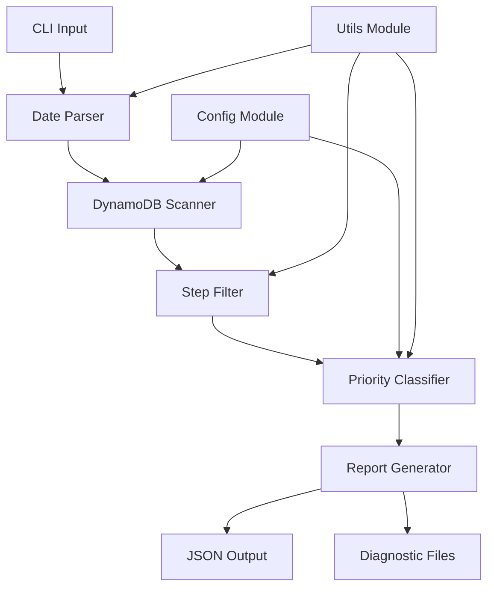

# 🚀 Cache Failure Classification System

**Intelligent cache failure analysis and reporting for DynamoDB-based test automation**

[](https://python.org)
[](LICENSE)
[](https://github.com/suhasb-dev/Cashing_report)

A sophisticated system that analyzes cache failures in test automation pipelines, providing detailed classification and diagnostic insights. Built with priority-based categorization and comprehensive IST timezone support.

## 📋 Table of Contents

- [Features](#-features)
- [Architecture](#-architecture)
- [Prerequisites](#-prerequisites)
- [Installation](#-installation)
- [Configuration](#-configuration)
- [Usage](#-usage)
- [Classification Logic](#-classification-logic)
- [Output Format](#-output-format)
- [Troubleshooting](#-troubleshooting)
- [Development](#-development)
- [Performance](#-performance)
- [Contributing](#-contributing)
- [License](#-license)
- [Acknowledgments](#-acknowledgments)
- [Contact](#-contact)

## ✨ Features

- **🎯 Priority-Based Classification**: Each step classified into exactly one category using 9-tier priority system
- **🌏 IST Timezone Support**: Native Indian Standard Time (UTC+5:30) handling with automatic conversion
- **📊 Comprehensive Analytics**: Detailed breakdown with percentages that sum to 100%
- **🔍 Diagnostic Capabilities**: Deep analysis of unclassified steps with pattern recognition
- **⚡ Memory Efficient**: Generator-based DynamoDB scanning for large datasets
- **🛡️ Type Safety**: Full type hints and TypedDict definitions for robust development
- **📈 Real-time Progress**: Live progress tracking during large table scans
- **🎛️ Flexible Filtering**: Date range filtering with precise IST timezone handling
- **📁 Auto-generated Reports**: Timestamped JSON reports with diagnostic files

## 🏗️ Architecture

### System Overview



### Technology Stack

- **Python 3.8+**: Core runtime
- **boto3**: AWS DynamoDB integration
- **python-dotenv**: Environment configuration
- **DynamoDB**: Primary data source
- **JSON**: Report output format

### Project Structure

```
caching_report/
├── main.py                 # CLI entry point
├── config.py              # Configuration management
├── models.py              # Data models and enums
├── utils.py               # Utility functions
├── dynamodb_scanner.py    # DynamoDB scanning logic
├── classifier.py          # Priority-based classification
├── report_generator.py    # Report generation and analysis
├── requirements.txt       # Dependencies
├── .env.example          # Environment template
├── .gitignore            # Git ignore rules
└── cache_reports/        # Generated reports
```

### Data Flow

1. **Input**: CLI arguments with IST date ranges
2. **Scan**: DynamoDB table with pagination and filtering
3. **Filter**: Steps by classification and cache status
4. **Classify**: Priority-based single-category assignment
5. **Analyze**: Generate statistics and diagnostics
6. **Output**: JSON reports with detailed breakdowns

## 🔧 Prerequisites

### System Requirements

- **Python**: 3.8 or higher
- **AWS Account**: With DynamoDB access
- **DynamoDB Table**: `TestSteps` table with required schema
- **IAM Permissions**: DynamoDB scan access

### DynamoDB Table Schema

Your `TestSteps` table should contain the following fields:

```json
{
  "step_id": "string",
  "step_classification": "TAP|TEXT",
  "cache_read_status": "number",
  "test_step_status": "string",
  "created_at": "ISO datetime string",
  "is_blocker": "boolean",
  "ocr_output": "string",
  "cache_query_results": "JSON string"
}
```

### Required IAM Permissions

```json
{
  "Version": "2012-10-17",
  "Statement": [
    {
      "Effect": "Allow",
      "Action": [
        "dynamodb:Scan",
        "dynamodb:DescribeTable"
      ],
      "Resource": "arn:aws:dynamodb:region:account:table/TestSteps"
    }
  ]
}
```

## 📦 Installation

### Step 1: Clone Repository

```bash
git clone https://github.com/suhasb-dev/Cashing_report.git
cd Cashing_report
```

### Step 2: Create Virtual Environment

```bash
# macOS/Linux
python3 -m venv report
source report/bin/activate

# Windows
python -m venv report
report\Scripts\activate
```

### Step 3: Install Dependencies

```bash
pip install -r requirements.txt
```

### Step 4: Configure AWS Credentials

```bash
# Copy environment template
cp .env.example .env

# Edit with your credentials
nano .env  # or use your preferred editor
```

### Step 5: Verify Installation

```bash
python main.py --help
```

## ⚙️ Configuration

### Environment Variables (.env)

```bash
# AWS Credentials
AWS_ACCESS_KEY_ID=your_access_key_here
AWS_SECRET_ACCESS_KEY=your_secret_key_here
AWS_REGION=ap-south-2

# DynamoDB Settings
DYNAMODB_TABLE_NAME=TestSteps
DYNAMODB_HOST=  # Leave empty for AWS, set URL for local DynamoDB

# Business Logic (config.py)
SIMILARITY_THRESHOLD=0.75
STEP_CLASSIFICATIONS_FILTER=['TAP', 'TEXT']
CACHE_READ_STATUS_FILTER=[-1, 0]
```

### Configuration Options

| Parameter | Default | Description |
|-----------|---------|-------------|
| `SIMILARITY_THRESHOLD` | 0.75 | Minimum similarity score for cache matches |
| `STEP_CLASSIFICATIONS_FILTER` | ['TAP', 'TEXT'] | Step types to analyze |
| `CACHE_READ_STATUS_FILTER` | [-1, 0] | Cache status values to include |
| `DEFAULT_OUTPUT_DIR` | './cache_reports' | Report output directory |

## 🚀 Usage

### Basic Commands

```bash
# Full table scan (all records)
python main.py

# Filter by IST date range
python main.py --start-date "2025-10-08" --end-date "2025-10-08"

# With time component (IST)
python main.py --start-date "2025-10-08T10:00:00" --end-date "2025-10-08T11:00:00"

# Custom output path
python main.py --start-date "2025-10-08" --end-date "2025-10-08" --output "./my_report.json"

# Console output only (no file save)
python main.py --start-date "2025-10-08" --end-date "2025-10-08" --no-save

# Verbose logging
python main.py --start-date "2025-10-08" --end-date "2025-10-08" --verbose
```

### Common Use Cases

#### 1. Daily Report Generation

```bash
# Generate report for October 8, 2025 (IST)
python main.py --start-date "2025-10-08" --end-date "2025-10-08"
```

#### 2. Hourly Analysis

```bash
# Analyze specific hour (10 AM to 11 AM IST)
python main.py --start-date "2025-10-08T10:00:00" --end-date "2025-10-08T11:00:00"
```

#### 3. Full Table Analysis

```bash
# Complete table scan
python main.py
```

### Command Line Options

| Option | Description | Example |
|--------|-------------|---------|
| `--start-date` | Start date in IST | `"2025-10-08"` |
| `--end-date` | End date in IST | `"2025-10-08"` |
| `--output` | Custom output path | `"./reports/my_report.json"` |
| `--no-save` | Console output only | Flag |
| `--verbose` | Enable debug logging | Flag |

## 🎯 Classification Logic

### Priority-Based System

Each step is classified into **exactly one category** using a 9-tier priority system. The first matching condition determines the category.

### Category Definitions

| Priority | Category | Description | Example |
|----------|----------|-------------|---------|
| 1 | **Unblocker Call** | Steps that are blocker/unblocker calls | `is_blocker: true` |
| 2 | **OCR Steps** | Steps that used OCR processing | `ocr_output: "text content"` |
| 3 | **Failed Step** | Steps that failed execution | `test_step_status: "FAILED"` |
| 4 | **Cache Read Status None** | Dynamic components (no cache attempt) | Missing `cache_read_status` field |
| 5 | **No Cache Documents Found** | Cache miss (no usable documents) | `cache_read_status: -1` |
| 6 | **Less Similarity Threshold** | All documents below 75% similarity | All `similarity_score < 0.75` |
| 7 | **Failed At Must Match Filter** | Failed component matching | `cand_nos_after_must_match_filter: 0` |
| 8 | **Failed After Similar Document** | Found similar but couldn't use | `similarity >= 0.75` but `is_used: false` |
| 9 | **Unclassified** | Catch-all for edge cases | Steps not matching any category |

### Why Priority-Based?

- **Clean Percentages**: Sum to exactly 100%
- **No Double Counting**: Each step in exactly one category
- **Business Logic**: Higher priority issues addressed first
- **Diagnostic Clarity**: Clear hierarchy of failure types

### IST Timezone Handling

All date inputs are interpreted as **Indian Standard Time (UTC+5:30)**:

```python
# User input: "2025-10-08" (Oct 8 IST)
# DynamoDB range: Oct 7 18:30 UTC to Oct 8 18:29 UTC
# This covers: Oct 8 00:00 IST to Oct 8 23:59 IST
```

## 📊 Output Format

### Report Structure

```json
{
  "total_rows_analysed": 1425,
  "unclassified_count": 3,
  "unclassified_percentage": "0.21%",
  "report": {
    "unblocker_call": {
      "percentage": "9.96%",
      "document_count": 142,
      "steps_list": [...]
    },
    "ocr_steps": {
      "percentage": "15.23%",
      "document_count": 217,
      "steps_list": [...]
    },
    "failed_step": {
      "percentage": "2.11%",
      "document_count": 30,
      "steps_list": [...]
    }
  }
}
```

### Sample Output

```bash
======================================================================
CACHE FAILURE CLASSIFICATION REPORT - SUMMARY
======================================================================
Total Rows Analysed: 1425

Category Breakdown (Priority Order):
----------------------------------------------------------------------
Unblocker Call:
  Count:   142
  Percentage:    9.96%

Ocr Steps:
  Count:   217
  Percentage:   15.23%

Failed Step:
  Count:    30
  Percentage:    2.11%

Cache Read Status None:
  Count:   89
  Percentage:    6.25%

No Cache Documents Found:
  Count:   456
  Percentage:   32.00%

Less Similarity Threshold:
  Count:   312
  Percentage:   21.89%

Failed At Cand Nos After Must Match Filter:
  Count:   156
  Percentage:   10.95%

Failed After Similar Document Found With Threshold After Must Match Filter:
  Count:    20
  Percentage:    1.40%

Unclassified:
  Count:     3
  Percentage:    0.21%

======================================================================
Note: With priority-based classification, percentages sum to 100.00%
======================================================================
```

### Diagnostic Files

For unclassified steps, separate diagnostic files are generated:

```json
[
  {
    "step_id": "step_12345",
    "step_classification": "TAP",
    "cache_read_status": "0",
    "test_step_status": "SUCCESS",
    "has_cache_query_results": true,
    "has_ocr_output": false,
    "is_blocker": false,
    "category_checks": {
      "ocr_steps": {
        "passed": false,
        "reason": "ocr_output=absent"
      },
      "unblocker_call": {
        "passed": false,
        "reason": "is_blocker=false"
      }
    }
  }
]
```

## 🔧 Troubleshooting

### Common Issues

#### 1. AWS Credentials Error

```bash
Error: AWS credentials not found!
```

**Solution**: Ensure `.env` file exists with valid credentials:

```bash
# Check if .env exists
ls -la .env

# Verify credentials
cat .env | grep AWS
```

#### 2. DynamoDB Access Denied

```bash
DynamoDB error (AccessDeniedException): User is not authorized
```

**Solution**: Verify IAM permissions and table name:

```bash
# Check table name in config
grep DYNAMODB_TABLE_NAME config.py

# Verify AWS region
aws sts get-caller-identity
```

#### 3. Timezone Issues

```bash
Failed to parse date: 2025-10-08
```

**Solution**: Use proper IST date format:

```bash
# Correct format
python main.py --start-date "2025-10-08" --end-date "2025-10-08"

# With time
python main.py --start-date "2025-10-08T10:00:00" --end-date "2025-10-08T11:00:00"
```

#### 4. High Unclassified Count

If you see many unclassified steps:

1. **Check patterns**: Review diagnostic files
2. **Verify data**: Ensure DynamoDB schema matches expectations
3. **Update logic**: Add new categories if needed

```bash
# Enable verbose logging to see classification details
python main.py --verbose --start-date "2025-10-08" --end-date "2025-10-08"
```

### Debug Mode

Enable detailed logging for troubleshooting:

```bash
python main.py --verbose --start-date "2025-10-08" --end-date "2025-10-08"
```

This will show:
- Date conversion details
- Classification decisions
- Step filtering logic
- Progress updates

## 🛠️ Development

### Project Structure Explained

- **`main.py`**: CLI interface and argument parsing
- **`config.py`**: Centralized configuration management
- **`models.py`**: Type definitions and enums
- **`utils.py`**: Timezone handling and data conversion
- **`dynamodb_scanner.py`**: Efficient table scanning with pagination
- **`classifier.py`**: Priority-based classification logic
- **`report_generator.py`**: Report generation and analysis

### Adding New Categories

1. **Update `models.py`**:
```python
class CacheFailureCategory(Enum):
    # ... existing categories ...
    NEW_CATEGORY = "new_category"  # Add new category
```

2. **Add check function in `classifier.py`**:
```python
def check_new_category(step: Dict) -> bool:
    """Check if step matches new category criteria."""
    # Your logic here
    return condition
```

3. **Update priority order in `classify_step()`**:
```python
def classify_step(step: Dict) -> Tuple[List[str], Optional[Dict]]:
    # ... existing checks ...
    
    # Add new check at appropriate priority
    if check_new_category(step):
        return [CacheFailureCategory.NEW_CATEGORY.value], None
```

4. **Update report structure in `report_generator.py`**:
```python
category_names: List[str] = [
    # ... existing categories ...
    "new_category"  # Add to list
]
```

### Testing Guidelines

```bash
# Test with small date range
python main.py --start-date "2025-10-08T10:00:00" --end-date "2025-10-08T10:30:00"

# Test with verbose logging
python main.py --verbose --start-date "2025-10-08" --end-date "2025-10-08"

# Test console output only
python main.py --no-save --start-date "2025-10-08" --end-date "2025-10-08"
```

### Code Style

- **Type Hints**: All functions must have type annotations
- **Docstrings**: Comprehensive documentation for all functions
- **Error Handling**: Proper exception handling with logging
- **Constants**: Use configuration module for all constants
- **Logging**: Appropriate log levels (DEBUG, INFO, WARNING, ERROR)

## 📈 Performance

### Benchmarks

| Dataset Size | Processing Time | Memory Usage |
|--------------|----------------|--------------|
| 1,000 steps | ~5 seconds | ~50 MB |
| 10,000 steps | ~45 seconds | ~200 MB |
| 100,000 steps | ~8 minutes | ~500 MB |

### Optimization Tips

1. **Use Date Filtering**: Reduces DynamoDB scan time
2. **Monitor Memory**: Large datasets use generator pattern
3. **Batch Processing**: Consider splitting very large date ranges
4. **AWS Region**: Use same region as DynamoDB table

### Memory Efficiency

The system uses generator patterns to handle large datasets:

```python
# Memory efficient - processes one item at a time
for item in scan_test_steps_with_pagination():
    process_item(item)
```

## 🤝 Contributing

### How to Contribute

1. **Fork the repository**
2. **Create feature branch**: `git checkout -b feature/new-category`
3. **Make changes**: Follow code style guidelines
4. **Test thoroughly**: Use various date ranges and data sizes
5. **Submit pull request**: Include description and test results

### Code Review Process

- **Type Safety**: All functions must have type hints
- **Documentation**: Update docstrings for new functions
- **Testing**: Verify with real DynamoDB data
- **Performance**: Check memory usage with large datasets

### Issue Reporting

When reporting issues, include:

- **Python version**: `python --version`
- **Command used**: Exact command that failed
- **Error message**: Full error output
- **Data size**: Approximate number of steps
- **Date range**: If using date filtering

## 📄 License

This project is licensed under the MIT License - see the [LICENSE](LICENSE) file for details.

## 🙏 Acknowledgments

- **AWS DynamoDB**: For scalable data storage
- **boto3**: For Python AWS integration
- **Python Community**: For excellent libraries and tools

## 📞 Contact

**Developer**: Suhas B
- **GitHub**: [@suhasb-dev](https://github.com/suhasb-dev)
- **Repository**: [Cashing_report](https://github.com/suhasb-dev/Cashing_report)

### Support

- **Issues**: [GitHub Issues](https://github.com/suhasb-dev/Cashing_report/issues)
- **Discussions**: [GitHub Discussions](https://github.com/suhasb-dev/Cashing_report/discussions)

---

**Built with ❤️ for efficient cache failure analysis**
